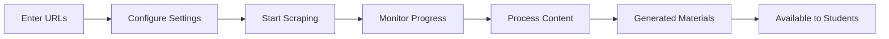

# 🚀 Web Scraping UI Integration - Quick Start Guide

## ✅ Implementation Complete!

The web scraping functionality has been successfully integrated with the UI. Here's what's been implemented:

## 🎯 What's New

### 1. **Admin Interface**
- New "Content Scraping" tab in Admin Dashboard
- Real-time progress monitoring
- Job history and status tracking
- Error handling and user feedback

### 2. **API Endpoints**
- `POST /api/scraping/trigger` - Start scraping jobs
- `GET /api/scraping/status/:jobId` - Monitor job progress
- `GET /api/scraping/jobs` - View job history
- `POST /api/scraping/process` - Process scraped content

### 3. **React Components**
- `ContentScrapingInterface` - Main scraping UI
- `useContentScraping` - Custom hook for API interactions

## 🔧 Setup Instructions

### 1. Environment Variables
Add these to your `.env` file:
```bash
# Required for scraping functionality
FIRECRAWL_API_KEY=your_firecrawl_api_key_here
SUPABASE_SERVICE_KEY=your_supabase_service_key_here

# Optional for enhanced processing
OPENAI_API_KEY=your_openai_api_key_here
GOOGLE_API_KEY=your_google_api_key_here
```

### 2. Python Dependencies
Install required Python packages:
```bash
pip install firecrawl-py supabase openai python-dotenv
```

### 3. Start the Application
```bash
# Start the backend server
npm run dev

# The scraping interface will be available at:
# http://localhost:3000/admin (Content Scraping tab)
```

## 🎮 How to Use

### Step 1: Access the Interface
1. Navigate to `http://localhost:3000/admin`
2. Click on the **"Content Scraping"** tab
3. You'll see the scraping interface

### Step 2: Start Scraping
1. **Enter URLs**: Paste educational URLs (one per line)
   ```
   https://www.khanacademy.org/science/biology/intro-to-biology
   https://www.ck12.org/biology/cell-structure/
   https://en.wikipedia.org/wiki/Photosynthesis
   ```

2. **Configure Settings**:
   - **Source Type**: Select from Khan Academy, CK-12, Wikipedia, etc.
   - **Subject**: Optional (e.g., "Biology", "Chemistry")
   - **Syllabus Code**: Optional (e.g., "1.1", "2.3")
   - **Difficulty Level**: 1-5 scale

3. **Click "Start Scraping"**

### Step 3: Monitor Progress
- Watch the real-time progress bar
- See which URLs are being processed
- View success/failure status for each URL
- Check detailed results and error messages

### Step 4: Process Content
1. Click **"Process Pending Content"** to generate educational materials
2. Monitor the processing job status
3. Generated content will appear in:
   - Topics section
   - Flashcards section
   - Quiz questions

## 📊 Example Workflow



## 🔍 Testing the Implementation

### Test 1: Simple Scraping
```bash
# Test URLs (safe for testing)
https://en.wikipedia.org/wiki/Cell_biology
https://en.wikipedia.org/wiki/Photosynthesis
```

### Test 2: Educational Content
```bash
# Khan Academy URLs
https://www.khanacademy.org/science/biology/intro-to-biology/what-is-biology
```

### Test 3: API Testing
```bash
curl -X POST http://localhost:3001/api/scraping/trigger \
  -H "Content-Type: application/json" \
  -H "Authorization: Bearer YOUR_JWT_TOKEN" \
  -d '{
    "sources": ["https://en.wikipedia.org/wiki/Biology"],
    "sourceType": "wikipedia",
    "subject": "Biology"
  }'
```

## 🎯 Key Features

### ✅ Real-time Updates
- Live progress tracking
- Instant status updates
- Error notifications

### ✅ Job Management
- View all scraping jobs
- Monitor completion status
- Retry failed jobs

### ✅ Content Generation
- Automatic topic creation
- Flashcard generation
- Quiz question creation
- Vector embeddings for search

### ✅ Error Handling
- Clear error messages
- Detailed failure reasons
- Graceful degradation

## 🚨 Important Notes

### Security
- All scraping endpoints require admin authentication
- Rate limiting is implemented
- Content validation is performed

### Performance
- Jobs run in background
- Non-blocking UI operations
- Efficient resource usage

### Content Quality
- AI-powered content generation
- Educational content validation
- Curriculum alignment

## 🐛 Troubleshooting

### Common Issues

1. **"Authentication required" error**
   - Ensure you're logged in as an admin
   - Check JWT token validity

2. **Python script fails**
   - Verify environment variables are set
   - Check Python dependencies are installed

3. **Scraping timeouts**
   - Try with fewer URLs
   - Check internet connectivity
   - Verify target websites are accessible

### Debug Steps
1. Check browser console for errors
2. Review server logs
3. Test with simple Wikipedia URLs first
4. Verify environment variables

## 🎉 Success Indicators

You'll know the implementation is working when:

1. ✅ "Content Scraping" tab appears in admin dashboard
2. ✅ You can enter URLs and start scraping jobs
3. ✅ Progress bar updates in real-time
4. ✅ Job history shows completed jobs
5. ✅ Generated content appears in database
6. ✅ Students can access enhanced educational materials

## 🔄 Data Flow

```
URLs → Firecrawl API → Raw Content → AI Processing → Educational Materials → Student Access
```

## 📈 Next Steps

1. **Test with Educational URLs**: Start with Wikipedia and Khan Academy
2. **Monitor Performance**: Check job completion times
3. **Review Generated Content**: Ensure quality and relevance
4. **Scale Gradually**: Add more sources as system proves stable
5. **Gather Feedback**: Monitor admin and student usage

## 🎯 Benefits Achieved

- ✅ **No Command Line Required**: Admins can scrape content via web interface
- ✅ **Real-time Monitoring**: See progress and results immediately
- ✅ **Automated Processing**: Content automatically becomes educational materials
- ✅ **Error Visibility**: Clear feedback on what works and what doesn't
- ✅ **Scalable Solution**: Handle multiple URLs and sources efficiently

The web scraping UI integration is now complete and ready for use! 🎉
