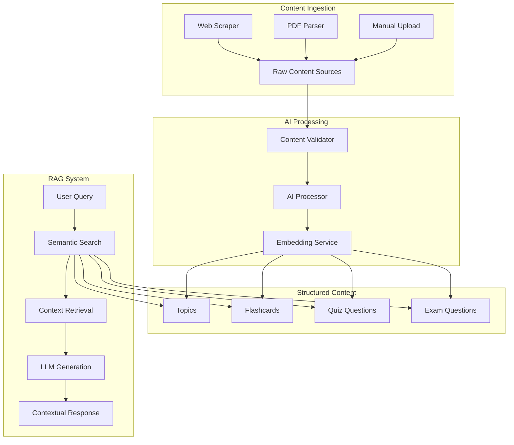

# AI-Powered IGCSE Content System Implementation Guide

## Overview

This document provides a comprehensive implementation guide for the AI-powered IGCSE content system with RAG (Retrieval-Augmented Generation) capabilities. The system transforms the existing IGCSE Student Guide into an intelligent learning platform that can generate contextual, syllabus-aligned educational content.

## Implementation Status

### ✅ Phase 1: Database Foundation & Schema Enhancement (COMPLETED)
- **Raw Content Staging Table**: Created `raw_content_sources` table for content ingestion pipeline
- **Vector Embeddings**: Added `embedding` columns to all content tables (topics, flashcards, quiz_questions, exam_questions)
- **Semantic Search Functions**: Implemented comprehensive RPC functions for vector similarity search
- **Performance Indexes**: Created optimized indexes for fast semantic search and content retrieval

### ✅ Phase 2: Content Ingestion Pipeline (COMPLETED)
- **Web Content Scraper**: Python script using Firecrawl for OER content from Khan Academy, CK-12, Wikipedia
- **PDF Content Parser**: Script for extracting text from Cambridge past papers and educational PDFs
- **Content Source Configuration**: JSON configuration for target URLs, processing rules, and validation criteria
- **Content Validation**: Comprehensive validation system for quality, license compliance, and syllabus alignment

### ✅ Phase 3: AI Processing & Vectorization Pipeline (COMPLETED)
- **AI Content Processing Engine**: LLM-powered content generation for topics, flashcards, and questions
- **Embedding Generation Service**: Multi-provider embedding service (OpenAI, Cohere) with batch processing
- **Content Structuring Pipeline**: Logic to convert unstructured content into structured database records
- **Quality Assurance**: Validation and fact-checking for AI-generated content

### 🔄 Phase 4: Retrieval Layer & Frontend Integration (NEXT)
- **Semantic Search Service**: TypeScript service for frontend semantic search
- **RAG Query Pipeline**: Retrieval-augmented generation for contextual responses
- **Enhanced Admin Forms**: Updated content generation with RAG capabilities
- **Student Search Interface**: Intelligent Q&A interface for students

## Architecture Overview



## Database Schema Enhancements

### New Tables

#### `raw_content_sources`
```sql
- id (UUID, Primary Key)
- source_url (TEXT) - URL of source content
- source_type (TEXT) - Type: khan_academy, ck12, past_paper, etc.
- raw_text (TEXT) - Extracted text content
- metadata (JSONB) - Flexible metadata storage
- processing_status (TEXT) - pending, processing, processed, failed
- content_hash (TEXT) - SHA-256 hash for duplicate detection
- embedding (vector(1536)) - Vector embedding for semantic search
- created_at, updated_at, processed_at (TIMESTAMP)
```

### Enhanced Existing Tables

All content tables now include:
- `embedding vector(1536)` - Vector embeddings for semantic search
- Optimized indexes for fast similarity search using HNSW algorithm

### Semantic Search Functions

#### `semantic_search_all(query_embedding, match_count, similarity_threshold)`
- Searches across all content types (topics, flashcards, questions)
- Returns ranked results with similarity scores and metadata

#### `semantic_search_by_subject(query_embedding, subject_id, match_count, similarity_threshold)`
- Subject-specific semantic search
- Filters results to specific IGCSE subject

#### `get_rag_context(query_embedding, match_count, subject_id, similarity_threshold)`
- Returns formatted context text for LLM prompts
- Optimized for RAG applications

## Content Processing Pipeline

### 1. Content Ingestion
```bash
# Scrape web content
python scripts/collect_web_content.py --config config/content_sources.json

# Parse PDF content
python scripts/collect_pdf_content.py --directory /path/to/pdfs --recursive

# Validate content
python scripts/content_validator.py --validate-pending
```

### 2. AI Processing
```bash
# Process raw content with AI
python scripts/process_raw_content.py --process-pending --batch-size 10

# Generate embeddings
python scripts/embedding_service.py --generate-missing --batch-size 50
```

### 3. Quality Assurance
- **Content Length Validation**: Ensures content meets minimum/maximum length requirements
- **Educational Content Check**: Validates presence of educational indicators and subject-specific keywords
- **License Compliance**: Checks for copyright violations and license compatibility
- **Syllabus Alignment**: Validates alignment with Cambridge IGCSE curriculum areas
- **Content Quality**: Checks for repetition, sentence structure, and overall quality

## Configuration Management

### Content Sources Configuration (`config/content_sources.json`)
```json
{
  "sources": [
    {
      "url": "https://www.khanacademy.org/math/algebra-basics",
      "source_type": "khan_academy",
      "subject": "Mathematics",
      "syllabus_code": "0580",
      "difficulty_level": 2
    }
  ],
  "processing_rules": {
    "content_validation": {
      "min_length": 100,
      "max_length": 50000,
      "required_keywords_by_subject": {...}
    },
    "license_validation": {
      "allowed_licenses": ["CC BY", "CC BY-SA", "CC BY-NC", "Public Domain"]
    }
  },
  "syllabus_mapping": {
    "Cambridge IGCSE": {
      "0580": {"name": "Mathematics", "major_areas": [...]}
    }
  }
}
```

## Cost Optimization Strategies

### 1. Embedding Generation
- **Batch Processing**: Process multiple items together to reduce API calls
- **Provider Selection**: Use Cohere API for cost-effective embeddings ($1/1M tokens vs OpenAI $0.10/1M tokens)
- **Content Deduplication**: Hash-based duplicate detection prevents reprocessing
- **Rate Limiting**: Intelligent rate limiting to stay within API quotas

### 2. LLM Usage
- **Context Optimization**: Retrieve only relevant content for RAG prompts
- **Response Caching**: Cache frequently requested content
- **Model Selection**: Use appropriate models for different tasks (GPT-4 for generation, smaller models for classification)

### 3. Database Optimization
- **Vector Indexes**: HNSW indexes for fast similarity search
- **Partial Indexes**: Index only active/published content
- **Query Optimization**: Efficient queries with proper filtering

## Security and Compliance

### 1. Content Licensing
- **Open Educational Resources**: Prioritize CC-licensed content from Khan Academy, CK-12
- **Attribution Tracking**: Maintain source attribution in metadata
- **Copyright Compliance**: Automated detection of copyrighted content

### 2. Data Privacy
- **No Personal Data**: System processes only educational content
- **Secure API Keys**: Environment variable management for API credentials
- **Access Control**: Row-level security for user-specific content

## Performance Metrics

### Expected Performance
- **Semantic Search**: <100ms for similarity queries
- **Content Generation**: 2-5 seconds per topic/question set
- **Embedding Generation**: ~1000 items per hour (with rate limiting)
- **Storage Efficiency**: ~2KB per embedding (1536 dimensions × 4 bytes)

### Monitoring
- **Processing Pipeline**: Track success/failure rates for each stage
- **API Usage**: Monitor token consumption and costs
- **Search Quality**: Track user satisfaction with search results
- **Content Quality**: Monitor validation pass/fail rates

## Next Steps: Phase 4 Implementation

### 1. Frontend Integration
- Create TypeScript service for semantic search
- Integrate RAG capabilities into existing admin forms
- Build student-facing intelligent search interface

### 2. Enhanced Features
- **Personalized Learning**: Use student progress data to customize content recommendations
- **Adaptive Questioning**: Generate questions based on student performance
- **Content Gaps Analysis**: Identify missing content areas using curriculum mapping

### 3. Advanced RAG Features
- **Multi-modal RAG**: Include diagrams and images in retrieval
- **Conversation Memory**: Maintain context across multiple queries
- **Source Citation**: Provide references to original content sources

## Environment Setup

### Required Environment Variables
```bash
# Supabase Configuration
SUPABASE_URL=your_supabase_url
SUPABASE_SERVICE_KEY=your_service_key

# AI/ML APIs
OPENAI_API_KEY=your_openai_key
COHERE_API_KEY=your_cohere_key  # Optional, for cost optimization

# Content Scraping
FIRECRAWL_API_KEY=your_firecrawl_key
```

### Dependencies
```bash
pip install supabase openai cohere firecrawl-py pdfplumber tiktoken numpy
```

## Conclusion

The AI-powered IGCSE content system provides a robust foundation for intelligent educational content generation and retrieval. The implemented RAG architecture enables:

1. **Automated Content Ingestion** from multiple educational sources
2. **AI-Powered Content Generation** aligned with IGCSE curriculum
3. **Semantic Search Capabilities** for contextual content discovery
4. **Quality Assurance** through comprehensive validation
5. **Cost-Effective Operations** through optimized API usage

The system is designed to scale efficiently while maintaining high content quality and educational relevance. Phase 4 implementation will complete the frontend integration, providing students and educators with an intelligent, context-aware learning platform.
