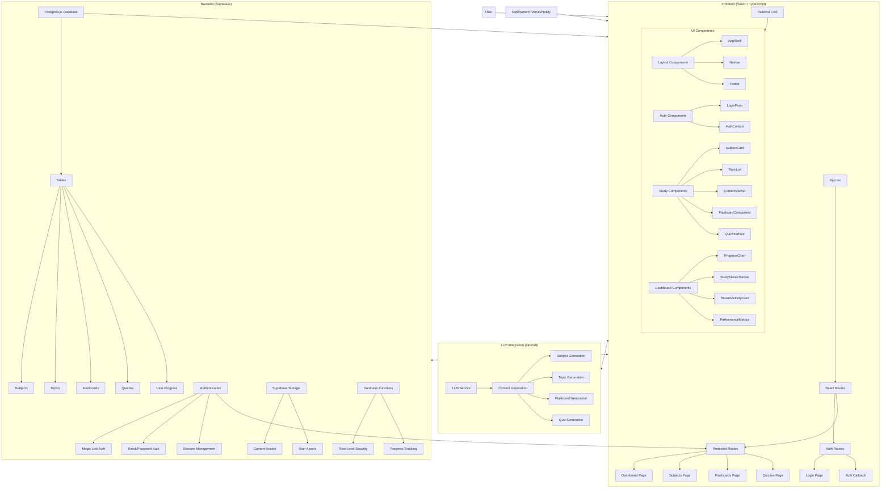

# IGCSE Student Guide Application Architecture

This document outlines the architecture of the IGCSE Student Guide web application, a comprehensive learning platform for IGCSE Grade 9-10 students.

## Application Overview

The IGCSE Student Guide is a modern, responsive web application targeted at IGCSE Grade 9-10 students to improve learning, engagement, and retention through interactive study tools. It provides features such as flashcards, quizzes, subject content, and progress tracking.

## Tech Stack

- **Frontend**: React with TypeScript and Tailwind CSS
- **Backend**: Supabase (Authentication, PostgreSQL Database, Storage)
- **Deployment**: Vercel or Netlify (planned)
- **Content Generation**: OpenAI integration (planned)

## Architecture Diagram

## Component Details

### Frontend Components

#### Layout Components
- **AppShell**: Main layout wrapper with responsive design
- **Navbar**: Navigation bar with auth state management
- **Footer**: Page footer with links and contact information

#### Authentication Components
- **LoginForm**: User authentication interface
- **AuthContext**: Global authentication state management
- **ProtectedRoute**: Route protection for authenticated users

#### Study Content Components
- **SubjectCard**: Display for subject information
- **TopicList**: Navigation for topics within subjects
- **ContentViewer**: Display for educational content with Markdown support
- **FlashcardComponent**: Interactive flashcard system with flip animation
- **QuizInterface**: Interactive quiz system with scoring

#### Dashboard Components
- **ProgressChart**: Visual representation of learning progress
- **StudyStreakTracker**: Track consecutive days of study
- **RecentActivityFeed**: Display recent learning activities
- **PerformanceMetrics**: Show performance statistics

### Backend Services (Supabase)

#### Authentication
- Magic link authentication (implemented)
- Email/password authentication (planned)
- Session management with token refresh

#### Database
- **Subjects Table**: Core subject information
- **Topics Table**: Topic content organized by subject
- **Flashcards Table**: Flashcard content by topic
- **Quizzes Table**: Quiz questions and answers by topic
- **User Progress Table**: Track user learning progress

#### Storage
- Content assets (images, diagrams)
- User assets (profile pictures, uploads)

#### Functions
- Row Level Security (RLS) for data protection
- Progress tracking functions

### LLM Integration (Planned)

- Integration with OpenAI for content generation
- Subject, topic, flashcard, and quiz generation
- Admin interface for content management

## Implementation Status

The application is currently approximately 45% complete:
- Authentication system is mostly implemented
- UI components and layout are complete
- Core content features are partially implemented
- Database schema and real data integration are pending
- Interactive features (flashcards, quizzes) are in development

## Future Enhancements

- Adaptive learning algorithm
- Advanced spaced repetition
- Collaborative study groups using Supabase real-time subscriptions
- Mobile app version
- Offline functionality with local storage sync
